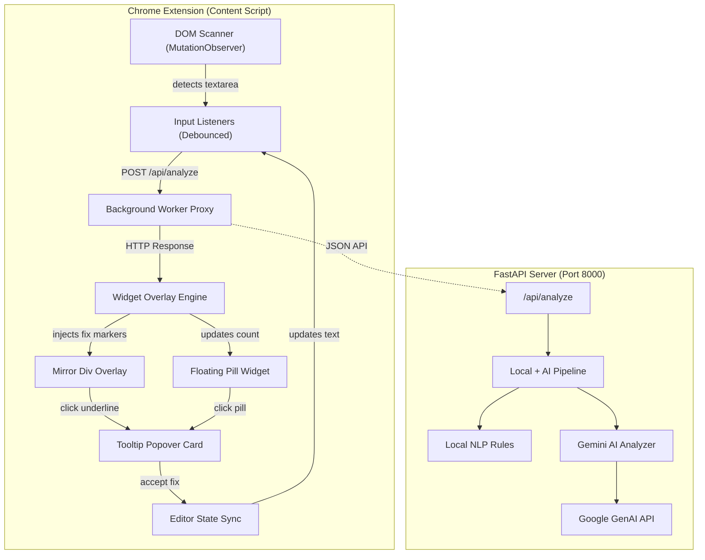

# Promptly — The Grammarly for Prompts

Promptly is a real-time, AI-powered Chrome extension that optimizes and refines prompts directly inside popular AI chat interfaces (ChatGPT, Claude, and Gemini). Think of it as **Grammarly, purpose-built for prompt engineering**.

It highlights clarity issues, missing context, and vague constraints as you type, and lets you apply optimizations inline with a single click.

---

## Key Features

- **Real-time in-page highlighting** — sub-second underlining (red for clarity, blue for context, green for constraints) directly over the text input of supported AI chat platforms.
- **Floating widget pill** — displays the current issue count and serves as a quick entry point for optimizations.
- **Inline optimization cards** — click any marked phrase to view an explanation and accept the suggested correction.
- **Seamless state synchronization** — updates React and Svelte-controlled text inputs without breaking the host platform's editor state.
- **Local + AI pipeline** — a rule-based parser paired with a Gemini-powered semantic analyzer, with automatic model fallback (`gemini-3.5-flash-lite` → `gemini-3.5-flash` → `gemini-2.0-flash-lite`) and built-in rate-limit retries.

---

## Architecture



---

## Repository Structure

```text
promptly/
├── backend/                      # Python FastAPI backend (modular design)
│   ├── app/
│   │   ├── api/
│   │   │   └── v1/
│   │   │       ├── endpoints/
│   │   │       │   └── analyze.py   # Route endpoints
│   │   │       └── router.py        # Unified router registry
│   │   ├── core/
│   │   │   └── config.py            # Configuration manager
│   │   ├── models/
│   │   │   └── schemas.py           # Pydantic schemas
│   │   ├── services/
│   │   │   ├── ai_engine.py         # Gemini client + fallback logic
│   │   │   ├── local_nlp.py         # Local rule-based heuristics
│   │   │   └── pipeline.py          # Pipeline orchestrator
│   │   └── main.py                  # FastAPI app entry point
│   ├── tests/                       # Integration tests
│   ├── .env.example
│   ├── Dockerfile                   # Production container build
│   ├── pyproject.toml               # Build & dependency metadata
│   └── requirements.txt
│
└── frontend/                     # Manifest V3 Chrome extension
    ├── assets/
    │   └── icons/                    # Extension icons
    ├── src/
    │   ├── background.js             # Worker script proxy
    │   ├── content.js                # DOM scanner & page observer
    │   ├── widget.js                 # Render engine & state sync
    │   └── styles.css                # Isolated overlay styles
    └── manifest.json
```

---

## Setup & Installation

### 1. Backend Setup

1. Navigate to the `backend/` directory:
   ```bash
   cd backend
   ```
2. Create and activate a Python virtual environment:
   ```bash
   python -m venv venv

   # macOS/Linux
   source venv/bin/activate

   # Windows
   .\venv\Scripts\activate
   ```
3. Install dependencies:
   ```bash
   pip install -r requirements.txt
   ```
4. Configure environment variables:
   - Copy `.env.example` to `.env`.
   - Add your Gemini API key:
     ```env
     GEMINI_API_KEY=your_gemini_api_key_here
     ```
5. Start the backend server:
   ```bash
   python -m uvicorn app.main:app --host 127.0.0.1 --port 8000
   ```

### 2. Chrome Extension Setup

1. Open Chrome and go to `chrome://extensions/`.
2. Enable **Developer mode** (top right).
3. Click **Load unpacked**.
4. Select the `frontend/` folder from this repository.
5. **Promptly — Grammarly for Prompts** is now installed and active.

---

## How to Run & Test

1. Confirm the backend server is running at `http://127.0.0.1:8000`.
2. Open [ChatGPT](https://chatgpt.com/), [Claude](https://claude.ai/), or [Gemini](https://gemini.google.com/).
3. Type a vague or underspecified prompt, for example:
   > *make a website it should be engaging and not too long*
4. Pause for about 1.5 seconds.
5. Colored underlines will appear:
   - **Red (Clarity):** flags *"make a"* → suggests *"Compose a structured"*.
   - **Blue (Context):** flags *"website"* → suggests specifying a target topic or audience.
   - **Green (Constraints):** flags *"engaging"* and *"not too long"* → suggests concrete, measurable criteria.
6. Click any underlined text, or the floating **P** pill, to open the optimization card.
7. Click **Accept Optimization** to replace the text instantly.

---

## Tech Stack

| Layer | Technologies |
|---|---|
| Backend | FastAPI, Pydantic, Google GenAI SDK, python-dotenv, Uvicorn |
| Frontend | Vanilla JavaScript (ES6), HTML5, CSS3 (injected overlays & animations) |
| Platform | Chrome Extension Manifest V3 |

---

## License

Add license details here (e.g., MIT, Apache 2.0) once finalized.
