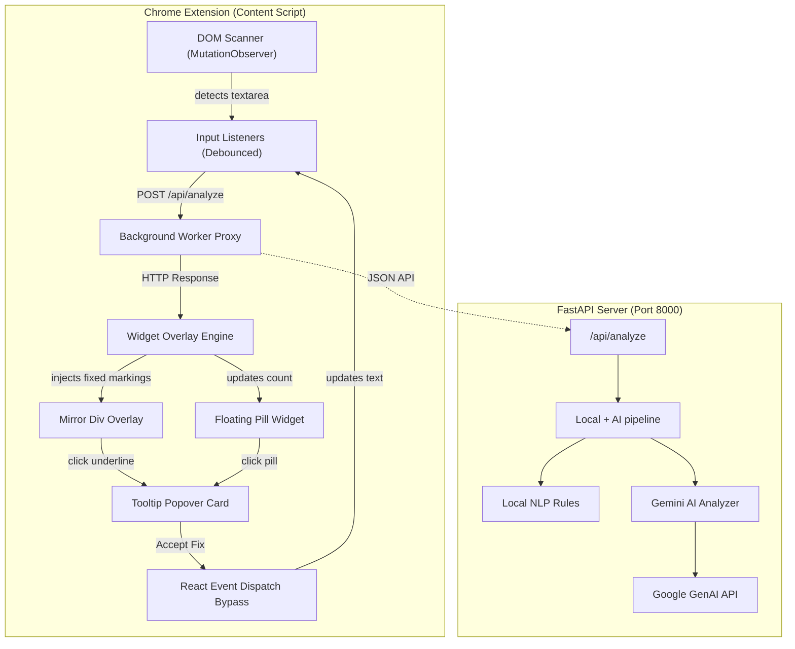

# Promptly — The Grammarly for Prompts 🚀

Promptly is a real-time, AI-powered Chrome Extension designed to optimize and refine your prompts directly inside popular AI chat interfaces (ChatGPT, Claude, and Gemini). Think of it as **Grammarly, but tailored specifically for prompt engineering**.

It highlights clarity issues, missing context, and vague constraints as you type, and lets you apply instant optimizations inline with a single click.

---

## 🌟 Key Features

* **Real-time In-page Highlights**: Sub-second text underlining (Red for Clarity, Blue for Context, Green for Constraints) directly on top of the text inputs of AI chats.
* **Floating Widget Pill**: Displays the current issue count and serves as an entry point for quick optimizations.
* **Inline Optimization Cards**: Click on any marked word/phrase to view the issue explanation and accept the suggested correction.
* **Seamless State Synchronization**: Bypasses React and Svelte state bindings to inject fixes without breaking the host platforms' editor state.
* **Local + AI Pipeline**: Combined rule-based parser and Gemini-powered semantic analyzer with automatic model fallback (`gemini-3.5-flash-lite` → `gemini-3.5-flash` → `gemini-2.0-flash-lite`) and rate-limit retries.

---

## 🏗️ Architecture



---

## 📁 Repository Structure

```text
promptly/
├── backend/                  # Python FastAPI Backend (Modular Design)
│   ├── app/
│   │   ├── api/
│   │   │   └── v1/
│   │   │       ├── endpoints/
│   │   │       │   └── analyze.py  # Route endpoints
│   │   │       └── router.py       # Unified router registry
│   │   ├── core/
│   │   │   └── config.py           # Configuration manager
│   │   ├── models/
│   │   │   └── schemas.py          # Pydantic schemas
│   │   ├── services/
│   │   │   ├── ai_engine.py        # Gemini Client fallbacks
│   │   │   ├── local_nlp.py        # Local rules heuristics
│   │   │   └── pipeline.py         # Pipeline analyzer
│   │   └── main.py                 # FastAPI Startup config
│   ├── tests/                      # Coordinate tests
│   ├── .env.example
│   ├── Dockerfile                  # Production containerization build
│   ├── pyproject.toml              # Build & dependency metadata
│   └── requirements.txt
│
└── frontend/                 # Manifest V3 Chrome Extension
    ├── assets/
    │   └── icons/                  # CENTRALIZED extension icons
    ├── src/
    │   ├── background.js           # Worker script proxy
    │   ├── content.js              # DOM scanner & page observer
    │   ├── widget.js               # Render engine & State-sync
    │   └── styles.css              # Isolated styles
    └── manifest.json
```

---

## 🛠️ Setup & Installation

### 1. Backend Setup

1. Navigate to the `backend/` directory:
   ```bash
   cd backend
   ```
2. Create and activate a Python virtual environment:
   ```bash
   python -m venv venv
   # On Windows:
   .\venv\Scripts\activate
   # On macOS/Linux:
   source venv/bin/activate
   ```
3. Install dependencies:
   ```bash
   pip install -r requirements.txt
   ```
4. Set up environment variables:
   * Copy `.env.example` to `.env`.
   * Add your Gemini API key:
     ```env
     GEMINI_API_KEY=your_gemini_api_key_here
     ```
5. Start the backend server:
   ```bash
   python -m uvicorn app.main:app --host 127.0.0.1 --port 8000
   ```

### 2. Chrome Extension Setup

1. Open Google Chrome and navigate to `chrome://extensions/`.
2. Enable **Developer Mode** by toggling the switch in the top right.
3. Click the **Load unpacked** button in the top left.
4. Select the `frontend/` folder from this repository.
5. The **Promptly — Grammarly for Prompts** extension will now be loaded!

---

## 🚀 How to Run & Test

1. Ensure the backend server is running on `http://127.0.0.1:8000`.
2. Open [ChatGPT](https://chatgpt.com/), [Claude](https://claude.ai/), or [Gemini](https://gemini.google.com/).
3. Type a vague or poorly constructed prompt, for example:
   > *make a website it should be engaging and not too long*
4. Pause for `1.5 seconds`.
5. You will see colored wavy underlines appear:
   * **Red (Clarity)**: Underlines *"make a"* (suggests *"Compose a structured"*).
   * **Blue (Context)**: Underlines *"website"* (suggests a targeted topic/audience).
   * **Green (Constraints)**: Underlines *"engaging"* and *"not too long"* (suggests concrete metrics).
6. Click any underlined text or the floating **P** pill widget to open the optimization card.
7. Click **✦ Accept Optimization** to replace the text instantly!

---

## 🧪 Tech Stack

* **Backend**: FastAPI, Pydantic, Google GenAI SDK, Python-dotenv, Uvicorn
* **Frontend**: Vanilla Javascript (ES6), HTML5, CSS3 (Injected overlays & animations)
* **Manifest Version**: Chrome Extension Manifest V3
